# DIU20Final - La Madriguera

Proyecto Final de la Asignatura de Diseño de Interfaces de Usuario

Alumno:
 * :bust_in_silhouette:   Naroa Alonso

He decidido crear **La Madriguera**, un sitio web para que las personas puedan ofrecer espacios de que dispongan o acceder a los espacios de otras personas para poder realizar un trabajo cooperativo, basado en la iniciativa de una empresa de Coworking, erranT. El enlace a la página web de erranT es el siguiente: https://www.errant.es/es/

En este caso se estudiará un caso de plataforma de economía colaborativa y realizaremos una propuesta para su diseño Web/movil. Utilizaremos herramientas y entregables descritos en el siguiente CheckList (https://github.com/mgea/UX-DIU-Checklist) 

>>> Este documento es el esqueleto del report final del caso de estudio.
-----

# Proceso de Diseño 

## Paso 1. UX Desk Research & Analisis 

> Toda la información referente al proceso de diseño se encuentra explicada en este documento README. No obstante, los documentos que se nombran en este paso se encuentran en la carpeta "Paso1_Desk_Research_Analysis", o en el enlace: https://github.com/NaroaAlonso/DIU20Final/tree/master/Paso1_Desk_Research_Analysis . Asimismo, cada apartado de este paso se comenta a continuación y los enlaces a los documentos a los que se hace referencia están indicados en cada momento.

### Análisis Competitivo

> Enlace al documento (en formato pdf): https://github.com/NaroaAlonso/DIU20Final/blob/master/Paso1_Desk_Research_Analysis/Analisis_competitivo.pdf

-----

El blog, el hecho de compartir las diferentes experiencias que han tenido los clientes contratando este servicio y la creación de comunidad (que inevitablemente hace que haya que gastar menos dinero en publicidad gracias al boca a boca y puede crear un nuevo paradigma de trabajo) son los puntos fuertes de erranT, en contraposición a la seriedad y la seguridad que ofrece Cubikate, ofreciendo estar abiertos las 24 horas del día e incluso un servicio de notificaciones de correspondencia urgente. 

Por otro lado, erranT no detalla a la perfección qué servicios ofrece del todo, no estableciendo un límite claro con el que poder "reclamar" algo o simplemente estar seguros de cuál es el servicio exacto que estoy contratando. Opuestamente, aunque Cubikate hace esto a la perfección, no se percibe que haya actividades dinámicas o que se salgan meramente del cuadro de un alquiler de oficinas estándar con servicio de secretaría.

### User Persona: María Fernanda Zambrano

> Enlace al documento (en pdf): https://github.com/NaroaAlonso/DIU20Final/blob/master/Paso1_Desk_Research_Analysis/Persona_MariaZambrano.pdf

-----

Esta persona se ha creado sin tener en cuenta la iniciativa que se quiere tomar (sitio web donde se pueda crear una comunidad de coworkers colaborativa), y representa la realidad de muchas personas en nuestro país.

### Journey Map

> Enlace al documento (en pdf): https://github.com/NaroaAlonso/DIU20Final/blob/master/Paso1_Desk_Research_Analysis/User_JMap.pdf

-----

Este Journey Map nos ha demostrado ciertos problemas de la web analizada, erranT, que podríamos resolver a través del diseño (aunque finalmente varíe un poco el servicio particular que se quiere ofrecer a los clientes). Las conclusiones que se pueden obtener son las siguientes:

- Para una persona que no conozca el concepto de coworking, no está realmente bien explicado en el sitio web y puede generar dudas y malas interpretaciones. Dado que la persona sobre la que se ha realizado el Journey Map es bastante activa, tomó la decisión de acercarse al sitio físico para preguntar, pero otro tipo de persona no hubiera hecho lo mismo.

- Las ofertas que se proponen en la web (las tarifas) son elevadas para esta persona, y además no se ajustan a sus necesidades temporales. Si bien la oferta no es algo que se pueda solucionar con el diseño web, sí que se puede pensar en alguna idea innovadora que lo solucione; como puede ser crear una comunidad de personas que cedan espacios que no usan al mes, o que los alquilen por horas, o donde varias personas se puedan poner en contacto para llegar a un acuerdo.

### Análisis de Usabilidad: erranT

> Enlace al documento (en formato Excel): https://github.com/NaroaAlonso/DIU20Final/blob/master/Paso1_Desk_Research_Analysis/Usability%20Review%20erranT.xls

> Enlace al documento (en formato pdf): https://github.com/NaroaAlonso/DIU20Final/blob/master/Paso1_Desk_Research_Analysis/Usability%20Review%20erranT.pdf

Se ha realizado un análisis de Usabilidad del sitio web de erranT al que se puede acceder pulsando en los enlaces anteriores para verlo o descargarlo en diferentes formatos. No se han incluido en este README capturas de pantalla del mismo porque el análisis contiene muchas páginas donde se detalla todo en bastante profundidad, por lo que a efectos generales, es más atractivo y dinámico que en este apartado únicamente se presenten las conclusiones obtenidas del mismo, que se detallan a continuación.

La puntuación obtenida en el análisis sobre el sitio web ha sido de *69 puntos sobre 100: Good*. Aunque se incluya dentro del espectro de _Bueno_, es la puntuación mínima para este descriptor (entre 69 y 89 puntos). A rasgos generales, una vez que se ha navegado bastante por el sitio, la sensación con la que considero que puede quedarse el usuario es de simpleza: es un sitio web muy simple y con funcionalidades muy limitadas.

##### Puntos fuertes

- Navegabilidad: es fácil moverse por las distintas páginas y conocemos nuestra ubicación dentro de la arquitectura en todo momento.

- Adaptabilidad a todo tipo de usuarios (sencillez de la página web): no importa que navegue por la web un usuario poco acostumbrado a las teconologías o que desconozca el concepto de _Coworking_ del que se habla en el sitio, debido a la sencillez del contenido es fácil entender un poco cómo funciona tras un rato navegando.

- Diseño dinámico y atractivo:la paleta de colores elegidas, las fotografías y la disposición del blog mantienen la atención del usuario.

##### Puntos débiles

- Internacionalización: aunque se hable de un espacio en Granada, cuando accedemos al sitio directamente nos manda a la versión en inglés (aunque se trate de un espacio en España), lo que puede llegar a ser comprensible porque quizás este tipo de servicio lo contraten en mayor medida personas extranjeras. No obstante, lo que no es comprensible, es que las etiquetas de las acciones del formulario, los errores del mismo o los errores del buscador aparezcan en inglés en la versión en castellano. Asimismo, en la versión en inglés no aparece la pestaña del Blog en el menú, posiblemente porque no haya entradas en otro idioma.

- Funcionalidad: a priori cuando se accede al sitio da la sensación de que no es una web meramente informativa, sino que se va a poder realizar algún trámite online. No obstante, únicamente podemos consultar información y disponemos de un formulario y de teléfonos y direcciones de correo para contactar, pero no podemos reservar salas, iniciar sesión ni mantener un contacto con la comunidad de coworkers, como en un principio se había pensado. Por lo tanto, no podemos consumir nada, tenemos que realizar otras acciones fuera del sitio (llamar por teléfono, acudir al establecimiento...) para poder hacer algo.

- Preguntas frecuentes, ayuda: apartados completamente inexistentes, lo que resulta bastante grave cuando se trata de una web meramente informativa.

- Información externa: accesibilidad, términos y condiciones, aviso legal: no disponemos de información sobre accesibilidad y, aunque existe un aviso legal, no se encuentra en el footer y es bastante difícil de encontrar (sólo se ha visualizado a través del buscador).

-----
-----

## Paso 2. UX Design 

> Toda la información sobre este paso está detallada en este README, aunque los documentos que se han utilizado para este proceso se encuentran en la carpeta Paso2_UX_Design, con el enlace: https://github.com/NaroaAlonso/DIU20Final/tree/master/Paso2_UX_Design . Asimismo, para cada documento al que se hace referencia a continuación se detalla el enlace donde se encuentra de forma individual.

### Malla receptora de la información

> La malla receptora de la información se encuentra en este enlace (en formato pdf): https://github.com/NaroaAlonso/DIU20Final/blob/master/Paso2_UX_Design/Malla_receptora_informacion.pdf

-----

Se puede observar en la malla que los puntos a mejorar de lo que ya existe tratan sobre la internacionalización y la inclusión de páginas de ayuda, lo que sin duda habría que mejorar o implementar para completar mínimamente el sitio web.

Como propuesta de valor se le puede añadir nueva funcionalidad al sitio que haga más atractivo el uso de la web y que de algún modo se espera: la posibilidad de proponer espacios personales para otros coworkers, la posibilidad de reservar espacios desde el sitio, la creación de comunidad y el poder contactar con otros coworkers, etcétera.

### Tasks & Sitemap

Se ha creado una matriz de tareas para identificar todo lo que se supone que se debe poder hacer en la página web según la propuesta de valor descrita anteriormente y se le ha atribuido un valor según la frecuencia de uso de los grupos de usuarios a los que va dirigida la plataforma. Se ha seleccionado este método porque visualmente es muy claro y se intuye a la perfección la importancia de cada tarea.

> El documento (en pdf) donde se encuentran tanto la matriz como las diversas tareas en su ranking se encuentra en el siguiente enlace: https://github.com/NaroaAlonso/DIU20Final/blob/master/Paso2_UX_Design/Task%20Matrix%20.pdf

_Leyenda de la matriz_: (frecuencia de uso) Se ha generado un ranking con los posibles valores de uso para cada grupo de las distintas tareas. Los valores pueden variar desde 0 (frecuencia de uso nula) hasta 4 (frecuencia de uso muy alta), pasando por 1 (frecuencia baja), 2 (frecuencia media) y 3 (frecuencia alta).

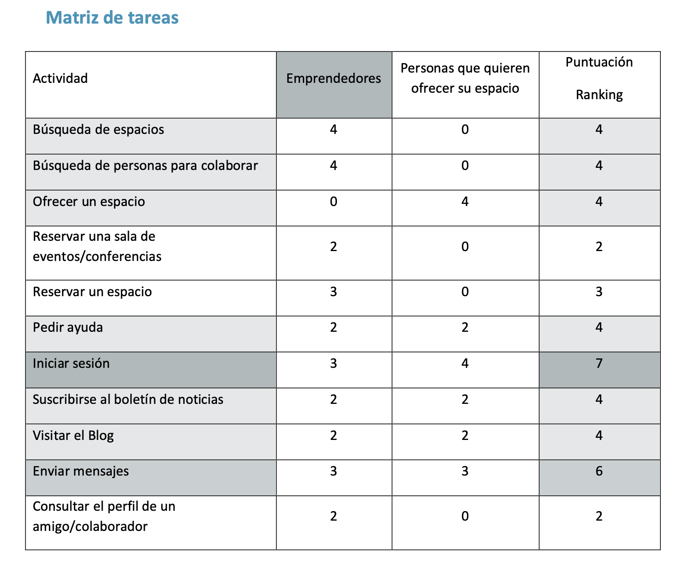
-----

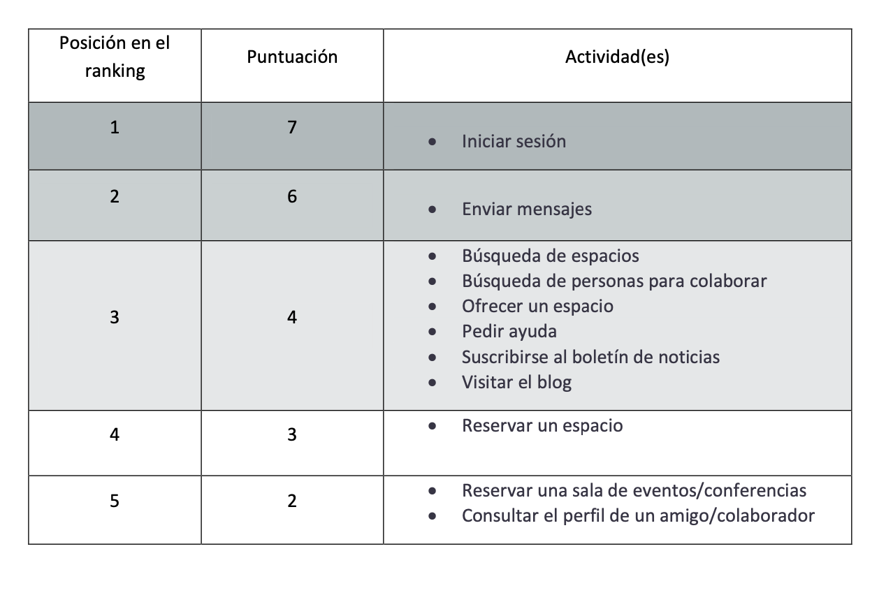
-----

-	El perfil crítico será el conjunto de personas emprendedoras que necesiten darle forma a su producto o que necesiten un espacio donde establecerse para poder trabajar, ya que serán los que más actividades realicen en la plataforma.

-	La tarea crítica será el inicio de sesión, debido a que para poder contactar con las personas que ofrecen sus espacios o con otros colaboradores o incluso para reservar estos sitios o las salas de conferencia necesitarán acceder a su perfil.

### Arquitectura del sitio y etiquetado

> El diagrama de la arquitectura del sitio se encuentra (en formato pdf) en el siguiente enlace: https://github.com/NaroaAlonso/DIU20Final/blob/master/Paso2_UX_Design/Arquitectura.pdf

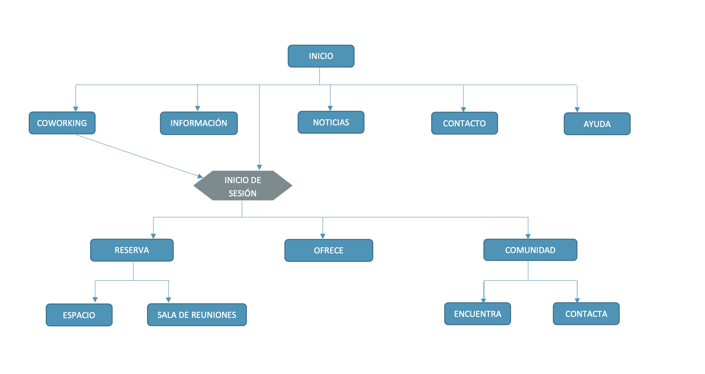
-----

Se ha decidido ampliar todo lo posible la funcionalidad de la web sin tener que iniciar sesión (por ejemplo, pudiendo buscar oficinas sin entrar a nuestro perfil, únicamente haría falta para reservarlas) para que se pueda navegar todo lo posible por la misma antes de acceder por primera vez; ya que por lo general, las personas son muy reticentes a entregar sus datos para crear una cuenta por primera vez en un sitio.

El etiquetado se especifica a continuación:

- **Inicio**: Página principal, primera instancia donde aparecerá información sobre qué es el Coworking, cómo funciona el sitio y desde donde se enlazará al resto de páginas a las que se pueden acceder.
- **Coworking**: Página de búsqueda: aquí aparecerá un buscador con filtros para poder ojear los espacios posibles o las salas de reuniones, sus precios, horarios e información en general.
- **Información**: Página donde se explica en detalle cómo funciona el coworking, cómo se puede reservar/ofrecer un espacio, cómo nos podemos incluir en la comunidad y para qué. Esta página, al ser informativa, también contendrá enlaces a la página de ayuda y de preguntas frecuentes.
- **Noticias**: Aquí se encontrarán las entradas del blog.
- **Contacto**: En esta página aparecerán números de teléfono, dirección de correo electrónico e incluso un formulario para contactar con la organización responsable de esta web. 
- **Ayuda**: Página donde se incluirá un chat, un apartado de preguntas frecuentes y un enlace a la página de contacto, por si hubiera más preguntas no resueltas.
- **Inicio de sesión**: Espacio donde se introduce el nombre de usuario y la contraseña para acceder a la sección personal de la web, para acceder a la parte de la comunidad y para poder ofrecer/reservar espacios.
- **Reserva**: Redirige al buscador (_Coworking_), pero esta vez cuando pulsemos el botón "Reserva" Nos llevará a la página de reserva y pago ya que la sesión estará iniciada.
- **Espacio**: Cuando aplicamos el filtro para poder reservar un espacio que haga de oficina.
- **Sala de reuniones** Cuando aplicamos el filtro en la reserva para poder acceder a una sala de reuniones.
- **Ofrece**: Página donde las personas que tienen un espacio pueden ofrecerlo a otros coworkers de manera gratuita/pago. Redirige a un formulario donde escribir toda la información necesaria.
- **Comunidad**: Accede a la parte de comunidad, la parte social, donde podemos contactar con otras personas. Aquí aparecen los datos del perfil personal y tenemos la opción de buscar personas para poder alquilarles una sala o para que nos ayuden con sus trabajos y viceversa.
- **Encuentra**: Aparecerá un filtro donde podamos buscar por temáticas a personas que nos ayuden. Se podrá buscar por nombre, área de conocimiento, etcétera.
- **Contacta**: Tendremos nuestros mensajes anteriores con otras personas y podremos escribir mensajes nuevos.

### Bocetos

En base a todo lo investigado y analizado anteriormente, se ha llevado a cabo el diseño de algunos bocetos de la web. Realmente deberían realizarse bocetos low fit, con mucha menos información de la que contienen los hechos; y tras hacer un primer diseño con poco detalle, un estudio de usabilidad y navegabilidad por la web para ver cómo se interactúa con la misma y poder encontrar algún fallo y corregirlo de cara a los bocetos más detallados. No obstante, debido al poco tiempo del que se dispone para realizar todo este caso de estudio, se ha procedido directamente a diseñar los bocetos con un poco más de detalle.

Se ha intentado cuidar mucho la navegabilidad y la usabilidad del sitio. Para ello, se han incluido breadcrumbs en todas las páginas (salvo en la de inicio) y se han incluido enlaces importantes en el footer. La pantalla de inicio siempre es accesible pinchando el logo y el menú siempre es visible, desde todas las páginas. 

#### Página de inicio

En la página de inicio se encuentra toda la información sobre la funcionalidad casi total de la web, y enlaces a todas las páginas.

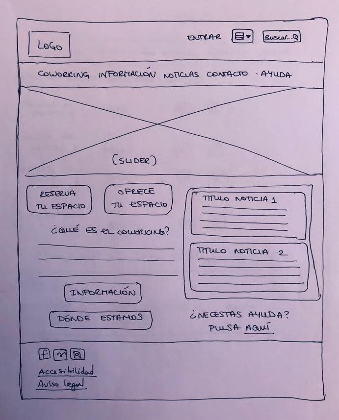
-----

- El menú, una vez se ha iniciado sesión, aparecerá constantemente de la siguiente manera:

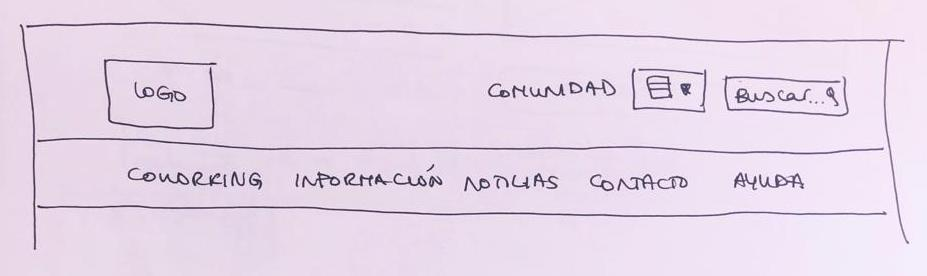
-----

#### Coworking

La página inicial para comenzar a buscar sería la siguiente:

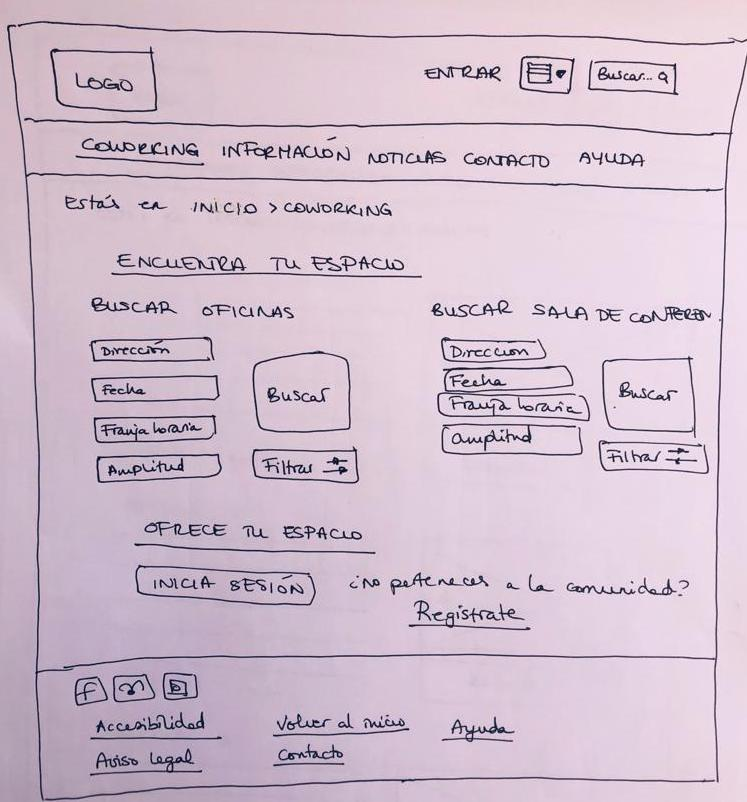
-----

Y una vez hemos comenzado la búsqueda, los resultados se presentarían de la forma siguiente:

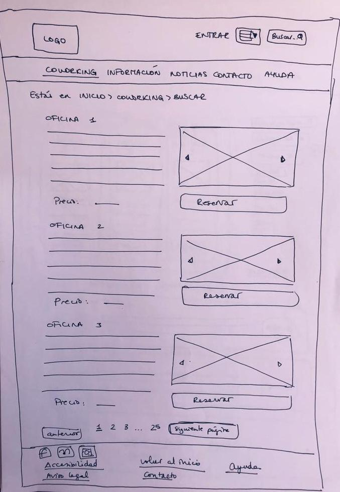
-----

_Nota_: Si pulsáramos el botón "Reservar" sin haber iniciado sesión, nos redirigiría a Iniciar sesión y una vez hubiésemos marcado nuestras credenciales, nos devolvería a esta página y podríamos pulsar reservar sin problema.

#### Información 

La página de información sería:

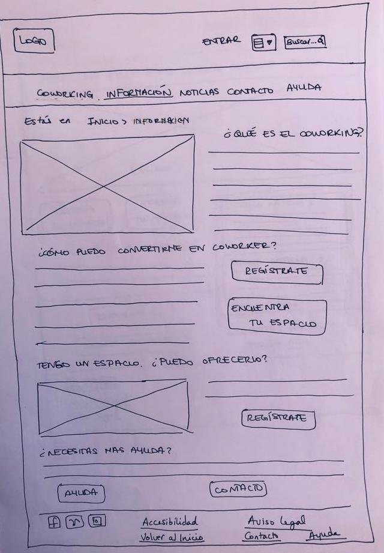
-----

#### Noticias

Y aquí la página de noticias:

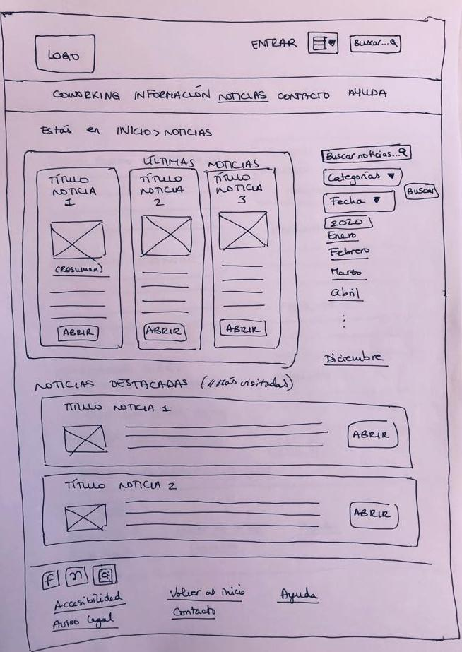
-----

#### Contacto

La página de contacto:

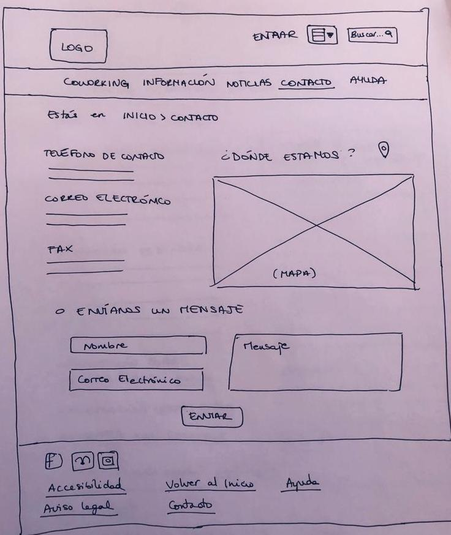
-----

#### Ayuda

La página de ayuda:

-----

#### Comunidad

Una vez pulsamos "Entrar", se nos redirige al **inicio de sesión**, que sería así:

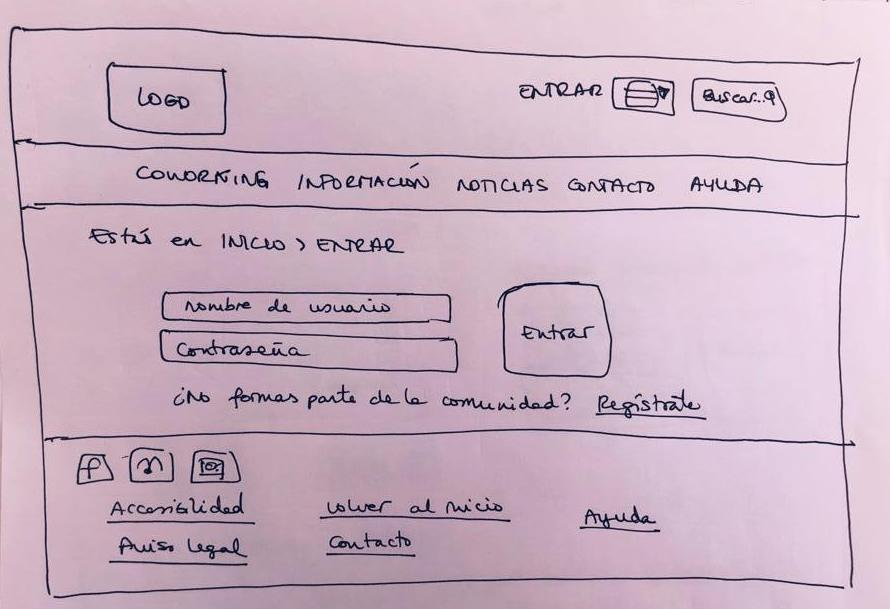
-----

Si no estuviésemos registrados y pulsásemos **Regístrate**, se nos redirigiría a la página:

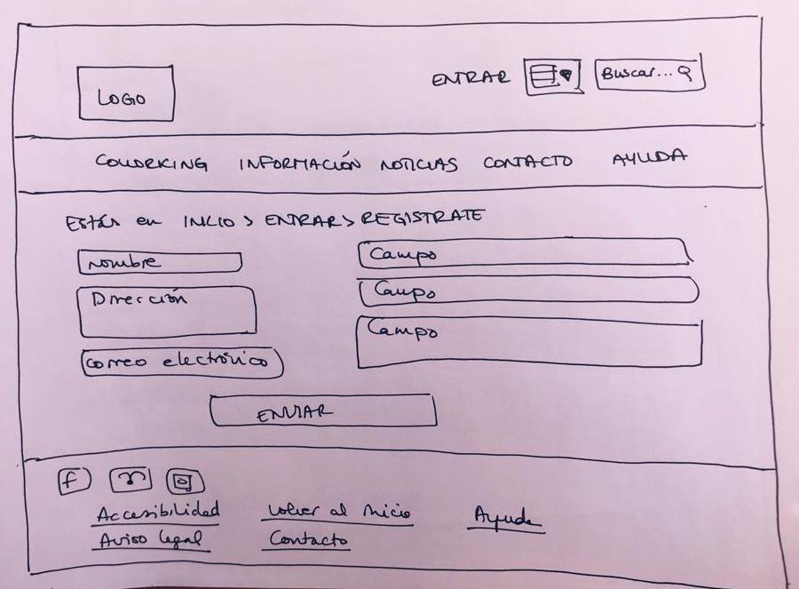
-----

Una vez iniciamos sesión, accedemos a la página de **comunidad**:

Y de ahí, podemos **Buscar otras personas**:

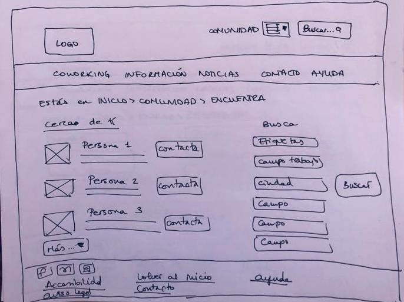
-----

Y podemos contactar con ellas o revisar los mensajes que ya hemos enviado o recibido con anterioridad (Pulsando **contacta**):

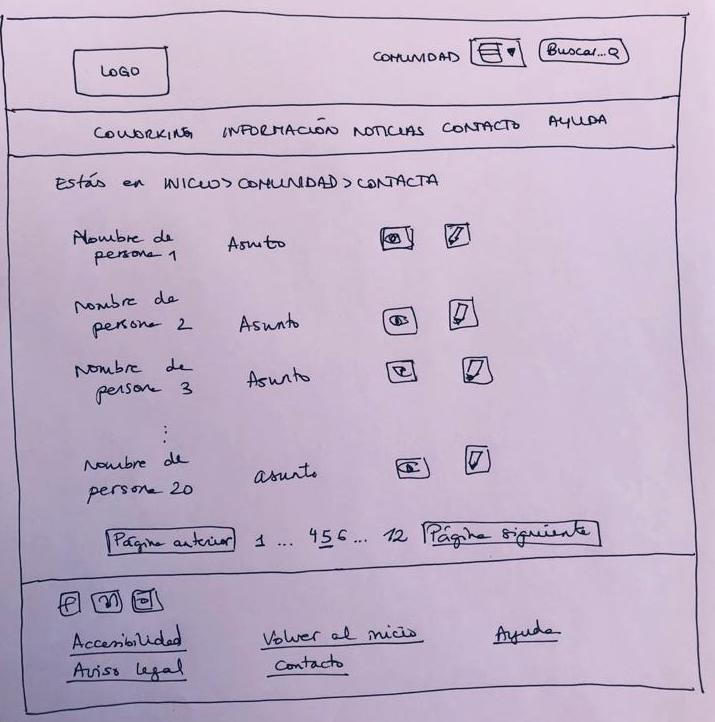
-----

_Nota_: Si se pulsa el botón "Ofrece tu espacio" Nos redirigiría a un formulario donde introducir toda la información. No se ha diseñado un boceto para este formulario porque únicamente se habrían puesto espacios con "Campo 1" "Campo 2"... "Campo x" y finalmente un botón de "Publicar".

